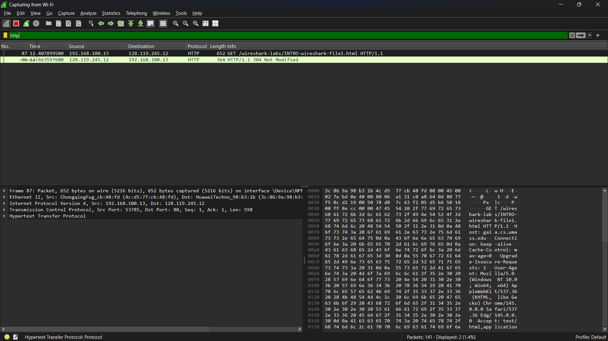
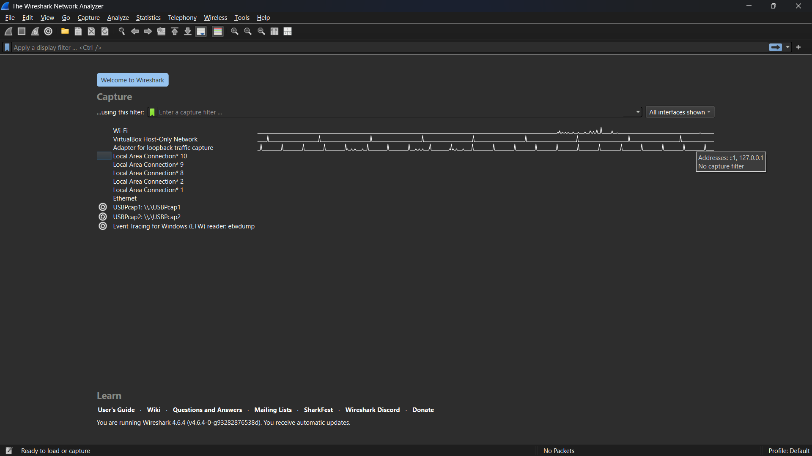
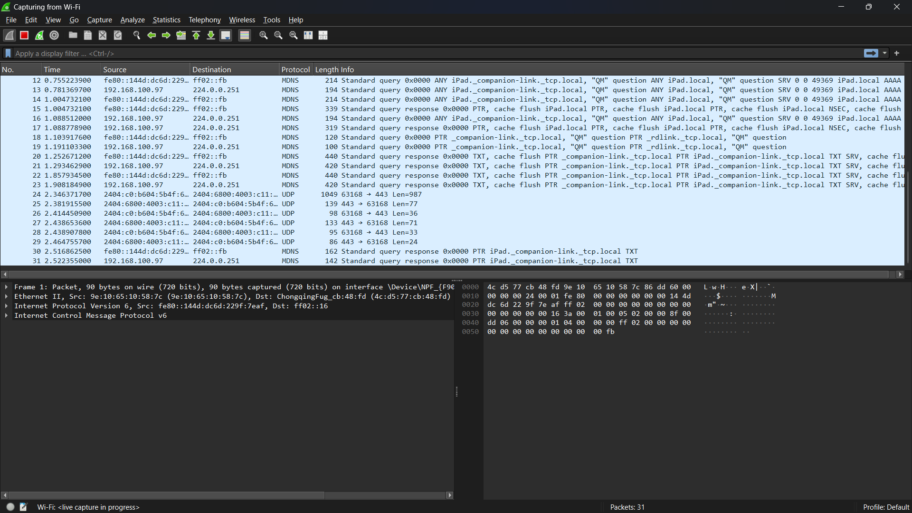

# Laporan Praktikum Jarkom
## MODUL 1 & 2 RUNNING
## TUJUAN PRAKTIKUM
 TAU CARA DONWLOAD WIRESHARK
## LANGKAH INSTAL WIRESHARK
 1. Donwload Wireshark Dan Python
 2. Run wireshark
## LAMPIRAN
HASIL:

