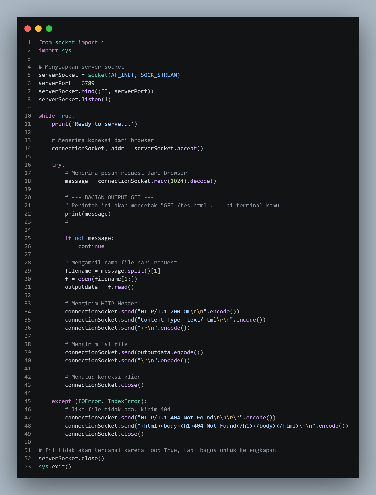
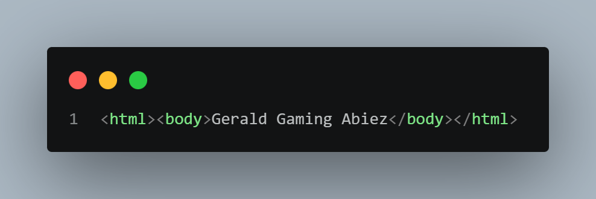
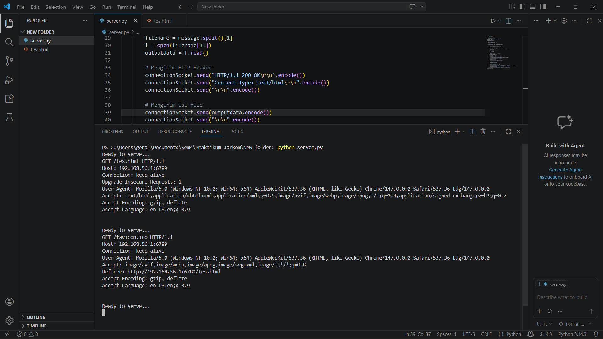
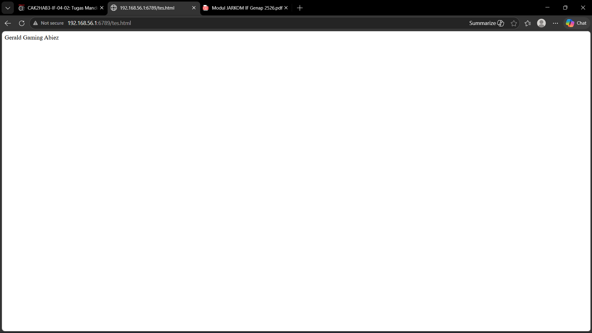

# LAPORAN PRAKTIKUM JARKOM
## MODUL 9 WEB SERVER
## Tujuan Praktikum
Mahasiswa bisa membuat program web server sederhana berbasis TCP socket programming

## Kode Sambung ke server menggunakan Python

## Kode untuk menampilkan di website menggunakan HTML

## Terminal saat di run

## Tampilan website sesudah di run

