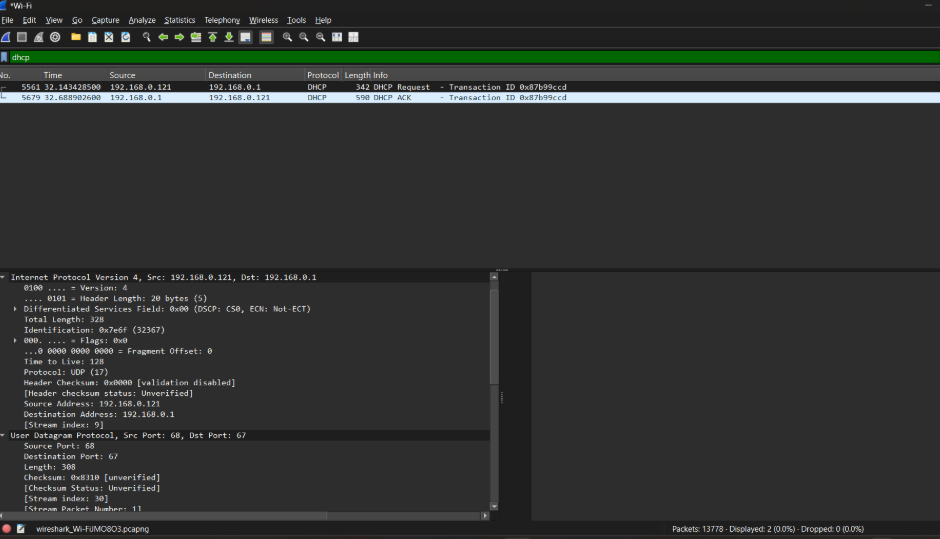

# LAPORAN PRAKTIKUM JARKOM
## MODUL 11 DHCP
## Tujuan Praktikum
1. Mahasiswa dapat menginvestigasi cara kerja protokol DHCP menggunakan Wireshark. 

# Tools yang Digunakan

| Tools | Fungsi |
|--------|--------|
| Wireshark | Menangkap dan menganalisis paket jaringan |
| Command Prompt | Menjalankan perintah jaringan |
| Sistem Operasi Windows | Lingkungan praktikum |

---

# Langkah-Langkah Praktikum

## 1. Melepaskan Alamat IP dari Client

Langkah pertama adalah membuka Command Prompt dan menjalankan perintah berikut:

```bash
ipconfig /release
```

Perintah tersebut digunakan untuk melepaskan alamat IP yang sedang digunakan oleh komputer. Setelah proses ini dilakukan, perangkat tidak lagi memiliki alamat IP aktif sehingga koneksi jaringan akan terputus sementara.

Tahapan ini dilakukan agar client dapat meminta alamat IP baru dari DHCP Server pada proses berikutnya.


> Menunjukkan hasil eksekusi perintah `ipconfig /release` yang digunakan untuk melepaskan alamat IP dari perangkat.

---

## 2. Menjalankan Wireshark

Setelah alamat IP dilepaskan, aplikasi Wireshark dijalankan dan dipilih interface jaringan yang sedang aktif. Selanjutnya proses packet capture dimulai agar seluruh lalu lintas jaringan dapat direkam.

Pada tahap ini Wireshark akan menangkap paket DHCP yang dikirimkan oleh client maupun server selama proses permintaan alamat IP berlangsung.

---

## 3. Meminta Alamat IP Baru

Selanjutnya kembali ke Command Prompt dan jalankan perintah berikut:

```bash
ipconfig /renew
```

Perintah ini digunakan untuk meminta konfigurasi jaringan baru kepada DHCP Server. Saat perintah dijalankan, client akan memulai proses komunikasi DHCP yang terdiri dari empat tahapan utama, yaitu:

1. DHCP Discover
2. DHCP Offer
3. DHCP Request
4. DHCP ACK

Seluruh paket yang dikirim dan diterima selama proses tersebut akan direkam oleh Wireshark.


> Menunjukkan hasil eksekusi perintah `ipconfig /renew` yang digunakan untuk memperoleh alamat IP baru dari DHCP Server.

---

## 4. Menghentikan Capture dan Menganalisis Paket

Setelah proses DHCP selesai, packet capture pada Wireshark dihentikan. Untuk mempermudah analisis, digunakan filter berikut:

```bash
dhcp
```

Filter tersebut berfungsi untuk menampilkan hanya paket-paket DHCP sehingga proses identifikasi tahapan komunikasi menjadi lebih mudah dilakukan.

Dari hasil capture dapat diamati paket DHCP Discover, DHCP Offer, DHCP Request, dan DHCP ACK.




> Menunjukkan hasil packet capture DHCP pada aplikasi Wireshark.

---

# Hasil dan Analisis

Berdasarkan hasil pengamatan menggunakan Wireshark, terlihat bahwa proses pemberian alamat IP oleh DHCP Server berlangsung secara berurutan melalui empat tahapan utama.

---

## 1. DHCP Discover

Tahap pertama dimulai ketika client mengirimkan paket DHCP Discover ke jaringan. Paket ini dikirim secara broadcast karena client belum memiliki alamat IP dan belum mengetahui lokasi DHCP Server.

Tujuan utama paket Discover adalah mencari server DHCP yang tersedia untuk memberikan konfigurasi jaringan.

---

## 2. DHCP Offer

Setelah menerima paket Discover, DHCP Server mengirimkan paket DHCP Offer sebagai balasan.

Paket ini berisi penawaran alamat IP yang dapat digunakan oleh client beserta informasi jaringan lainnya seperti:

- Subnet Mask
- Default Gateway
- DNS Server
- Lease Time

Tahap ini menunjukkan bahwa server siap memberikan konfigurasi jaringan kepada client.

---

## 3. DHCP Request

Setelah menerima penawaran dari server, client mengirimkan paket DHCP Request.

Paket ini digunakan untuk mengonfirmasi bahwa client menerima alamat IP yang ditawarkan dan ingin menggunakan konfigurasi tersebut.

Tahapan ini juga membantu mencegah terjadinya konflik alamat IP pada jaringan.

---

## 4. DHCP ACK

Tahap terakhir adalah DHCP ACK (Acknowledgement).

Pada tahap ini server memberikan konfirmasi bahwa alamat IP telah resmi diberikan kepada client. Setelah paket ACK diterima, client dapat menggunakan alamat IP tersebut untuk berkomunikasi di dalam jaringan.

Dengan diterimanya paket ACK, proses DHCP dinyatakan selesai.

---

# Kesimpulan

1. DHCP memudahkan proses konfigurasi jaringan dengan memberikan alamat IP secara otomatis kepada client.
2. Proses DHCP berlangsung melalui empat tahapan utama yaitu Discover, Offer, Request, dan ACK.
3. Wireshark berhasil digunakan untuk menangkap dan menganalisis paket DHCP yang dikirim selama proses konfigurasi jaringan.
4. Hasil pengamatan menunjukkan bahwa komunikasi antara client dan DHCP Server berjalan dengan baik.
5. Praktikum ini membantu memahami proses pemberian alamat IP serta analisis paket jaringan menggunakan Wireshark.

---