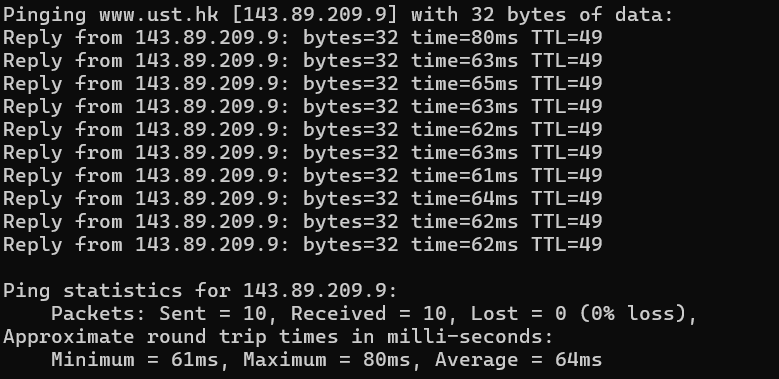
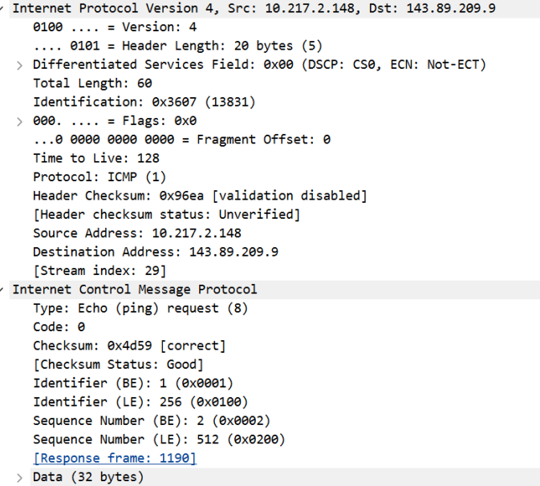
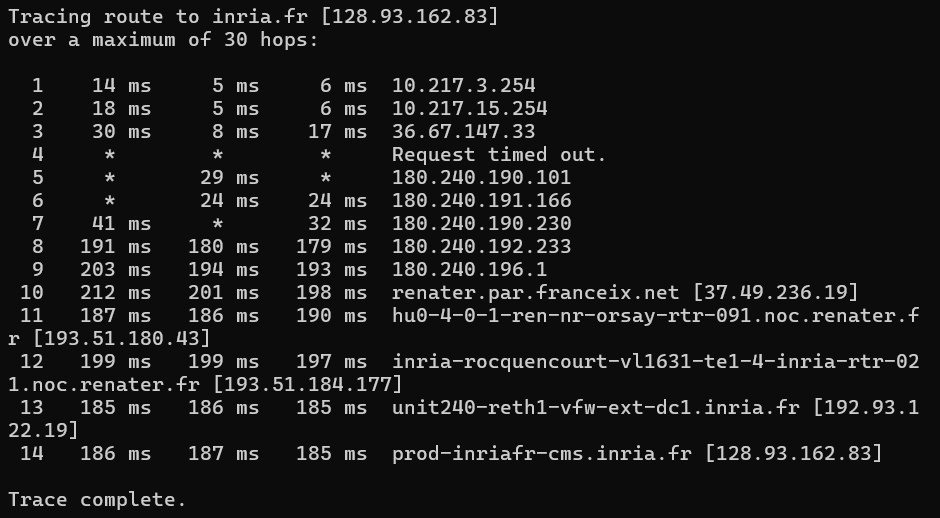
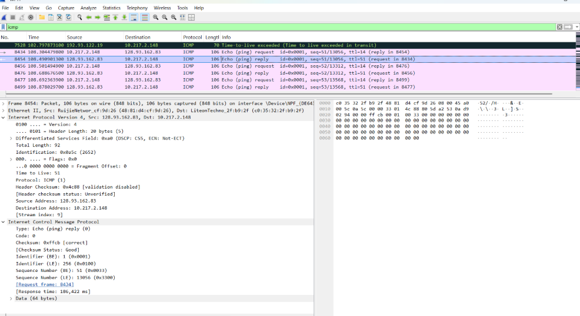

# LAPORAN PRAKTIKUM JARKOM
## MODUL 12 ICMP dan Asistensi Tugas Besar  
## Tujuan Praktikum
1. Mahasiswa dapat menginvestigasi cara kerja protokol ICMP menggunakan Wireshark 
2. Mahasiswa dapat membuat program ICMP Pinger 
3. Melakukan asistensi dan laporan progress pengerjaan tugas besar 

# 2. Persiapan Tools

## 2.1 Wireshark

Wireshark digunakan untuk menangkap dan menganalisis paket jaringan selama praktikum berlangsung.

- Status: Terinstal dan dapat digunakan
- Versi: 4.0.3
- Filter yang digunakan: `icmp`

## 2.2 Python

Python digunakan untuk pembuatan program ICMP Pinger sederhana.

- Status: Terinstal
- Versi: 3.11.0
- Library yang digunakan:
  - `socket`
  - `struct`
  - `time`
  - `os`

## 2.3 Command Prompt

Command Prompt digunakan untuk menjalankan perintah jaringan seperti ping dan traceroute.

- Platform: Windows 11
- Lokasi: `C:\Windows\System32`

---

# 3. Langkah Kerja

## 3.1 Pengamatan ICMP Menggunakan Ping

1. Membuka Command Prompt.
2. Menjalankan Wireshark dan memulai proses capture.
3. Menjalankan perintah:

```bash
ping -n 10 www.ust.hk
```

4. Menunggu hingga seluruh paket selesai dikirim dan diterima.
5. Menghentikan capture pada Wireshark.
6. Memfilter paket menggunakan filter:

```text
icmp
```

7. Menganalisis paket Echo Request dan Echo Reply.

---

## 3.2 Pengamatan ICMP Menggunakan Traceroute

1. Menjalankan Wireshark.
2. Memulai packet capture pada interface aktif.
3. Menjalankan perintah:

```bash
tracert www.inria.fr
```

4. Menunggu proses traceroute selesai.
5. Menghentikan capture.
6. Memfilter paket menggunakan filter ICMP.
7. Mengamati paket ICMP Time Exceeded dan Echo Reply.

---

## 3.3 Asistensi Tugas Besar

Kegiatan asistensi dilakukan dengan menyiapkan dokumentasi perkembangan proyek yang meliputi:

- Source code sementara
- Diagram sistem
- Laporan perkembangan
- Kendala yang ditemui selama pengembangan

Selanjutnya dilakukan konsultasi dengan asisten laboratorium terkait implementasi sistem dan solusi atas permasalahan yang ditemukan.

---

# 4. Hasil dan Pembahasan

## 4.1 Output Command Prompt - Ping

Pengujian pertama dilakukan menggunakan perintah:

```bash
ping -n 10 www.ust.hk
```



> Menunjukkan hasil pengujian konektivitas menggunakan perintah ping ke www.ust.hk.

### Hasil Pengamatan

- 10 paket berhasil dikirim.
- 10 paket berhasil diterima.
- Tidak terjadi packet loss.
- RTT berada pada rentang 61–80 ms.
- TTL yang diterima bernilai 49.

### Analisis

Hasil pengujian menunjukkan bahwa komunikasi antara host lokal dan server tujuan berjalan dengan baik. Seluruh paket berhasil diterima kembali tanpa kehilangan data sehingga koneksi dapat dikatakan stabil.

---

## 4.2 Analisis Paket ICMP Ping di Wireshark


> Menunjukkan hasil capture paket ICMP pada Wireshark.

Dari hasil capture terlihat adanya pasangan paket ICMP Echo Request dan Echo Reply yang digunakan untuk proses ping.

---

### Detail Paket ICMP Echo Request



> Menunjukkan detail struktur paket ICMP Echo Request.

#### Informasi Penting

| Field | Nilai | Keterangan |
|---------|---------|---------|
| Type | 8 | Echo Request |
| Code | 0 | Tidak ada kode error |
| Identifier | 1 | Identitas paket |
| Sequence Number | 2 | Urutan paket |
| Data Length | 32 bytes | Payload paket |

#### Analisis

Paket Echo Request dikirim oleh host lokal menuju server tujuan sebagai permintaan respons. Paket ini digunakan untuk mengukur konektivitas dan waktu tempuh paket dalam jaringan.

---

### Detail Paket ICMP Echo Reply


> Menunjukkan detail struktur paket ICMP Echo Reply.

#### Informasi Penting

| Field | Nilai | Keterangan |
|---------|---------|---------|
| Type | 0 | Echo Reply |
| Code | 0 | Tidak ada kode error |
| Identifier | 1 | Sama dengan request |
| Sequence Number | 2 | Sama dengan request |

#### Analisis

Echo Reply merupakan balasan dari server tujuan setelah menerima Echo Request. Kesamaan identifier dan sequence number menunjukkan bahwa paket balasan sesuai dengan paket yang dikirim sebelumnya.

---

## 4.3 Output Command Prompt - Traceroute

Pengujian traceroute dilakukan menggunakan perintah:

```bash
tracert www.inria.fr
```



> Menunjukkan hasil traceroute menuju server www.inria.fr.

### Hasil Pengamatan

- Total jalur yang dilalui sebanyak 14 hop.
- Setiap hop mengirim tiga paket probe.
- Beberapa router tidak memberikan respons sehingga muncul timeout.
- Host tujuan berhasil dicapai.

### Analisis

Traceroute berhasil memperlihatkan jalur yang dilalui paket dari komputer lokal menuju server tujuan di Perancis. Perbedaan waktu respons pada setiap hop menunjukkan kondisi jaringan yang berbeda-beda pada setiap segmen jalur.

---

## 4.4 Analisis Paket ICMP Traceroute di Wireshark



> Menunjukkan paket ICMP yang dihasilkan selama proses traceroute.

### Informasi Penting

| Field | Nilai |
|---------|---------|
| Type | 0 |
| Code | 0 |
| TTL | 51 |
| Response Time | 186.422 ms |

### Analisis

Pada tahap akhir traceroute, host tujuan memberikan respons berupa ICMP Echo Reply yang menandakan bahwa paket telah berhasil mencapai destination.

---

### Detail Paket ICMP Time Exceeded


> Menunjukkan detail paket ICMP Time Exceeded.

#### Informasi Penting

| Field | Nilai | Keterangan |
|---------|---------|---------|
| Type | 11 | Time Exceeded |
| Code | 0 | TTL Expired in Transit |
| Checksum | Valid | Paket valid |

#### Analisis

Paket ICMP Time Exceeded dikirim oleh router ketika nilai TTL mencapai nol sebelum paket mencapai tujuan. Mekanisme ini dimanfaatkan oleh traceroute untuk mengetahui setiap router yang dilewati paket selama perjalanan menuju destination.

---

# 5. Pembahasan

## 5.1 Perbandingan Ping dan Traceroute

### Ping

- Menggunakan ICMP Echo Request dan Echo Reply.
- Digunakan untuk menguji konektivitas jaringan.
- Menampilkan nilai RTT dan packet loss.

### Traceroute

- Menggunakan nilai TTL yang meningkat secara bertahap.
- Menampilkan jalur yang dilalui paket.
- Menghasilkan paket ICMP Time Exceeded dari router yang dilewati.

---

## 5.2 Analisis Performa Jaringan

### Pengujian Ping

- RTT rata-rata sekitar 64 ms.
- Packet loss 0%.
- Koneksi tergolong stabil.

### Pengujian Traceroute

- Total 14 hop menuju tujuan.
- Beberapa hop mengalami timeout.
- Tujuan akhir berhasil dicapai.

---

## 5.3 Analisis TTL

Nilai TTL yang diterima saat pengujian ping adalah 49.

Jika TTL awal diasumsikan sebesar 128, maka paket telah melewati sekitar 79 router sebelum mencapai tujuan.

Pada traceroute, nilai TTL ditingkatkan secara bertahap sehingga setiap router yang dilalui dapat diketahui melalui pesan ICMP Time Exceeded yang dikirimkan kembali.

---

## 5.4 Analisis Packet Loss

### Ping

- Packet loss = 0%.
- Semua paket berhasil diterima kembali.

### Traceroute

- Beberapa hop mengalami timeout.
- Timeout umumnya disebabkan oleh kebijakan keamanan router atau firewall.
- Walaupun terdapat timeout, host tujuan tetap berhasil dicapai.

---

# 6. Kesimpulan

1. ICMP digunakan untuk mendukung proses pengujian konektivitas dan diagnosis jaringan melalui Echo Request, Echo Reply, serta Time Exceeded.
2. Hasil pengujian ping menunjukkan koneksi yang stabil dengan packet loss 0% dan waktu respons yang relatif rendah.
3. Traceroute berhasil menampilkan jalur komunikasi dari host lokal menuju server tujuan melalui beberapa router yang berbeda.
4. Wireshark memudahkan proses analisis paket ICMP dengan menampilkan struktur dan informasi paket secara rinci.
5. Praktikum ini membantu memahami cara kerja ICMP, mekanisme TTL, serta proses pengiriman paket dalam jaringan komputer.

---