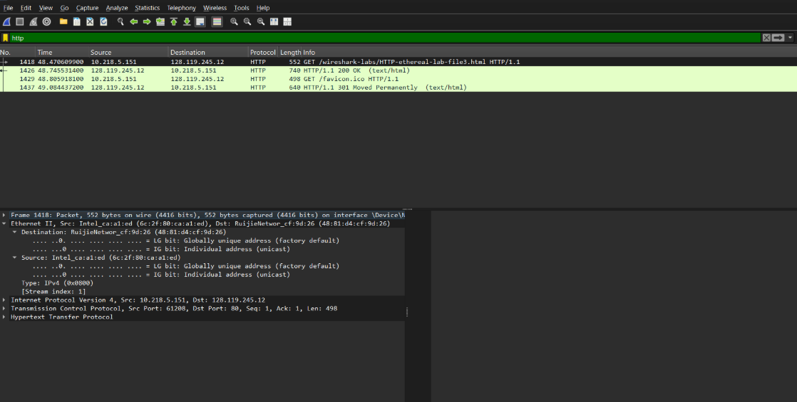
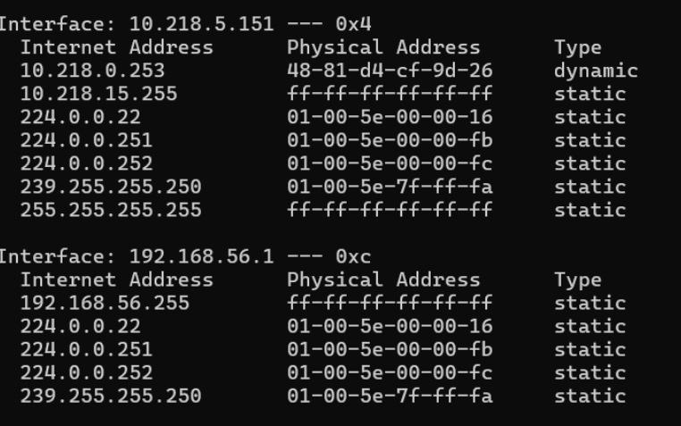
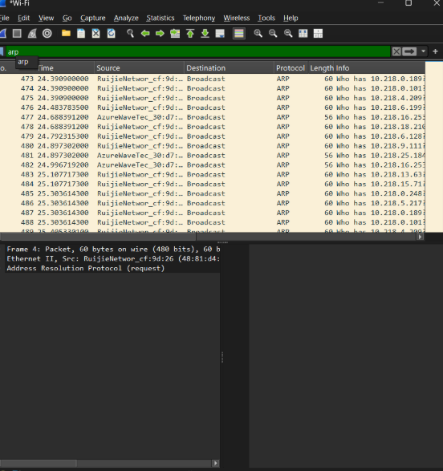

# LAPORAN PRAKTIKUM JARKOM
## MODUL 13 Ethernet and ARP  
## Tujuan Praktikum
1. Mahasiswa dapat menginvestigasi cara kerja Ethernet dan ARP menggunakan Wireshark

# Tools yang Digunakan

| Tools | Fungsi |
|--------|--------|
| Wireshark | Melakukan capture dan analisis paket jaringan |
| Command Prompt | Menjalankan perintah ARP |
| Sistem Operasi Windows | Lingkungan praktikum |

---

# Langkah-Langkah Praktikum

## 1. Menangkap dan Menganalisis Frame Ethernet

Langkah pertama dilakukan dengan membuka aplikasi Wireshark dan memilih interface jaringan yang aktif. Setelah proses capture dimulai, dilakukan aktivitas jaringan sehingga paket yang melewati interface dapat direkam.

Selanjutnya salah satu frame Ethernet dipilih untuk dianalisis. Informasi yang dapat diamati meliputi Source MAC Address, Destination MAC Address, dan EtherType yang menunjukkan jenis protokol yang dibawa oleh frame tersebut.

Masukkan URL berikut ke browser:

```text
http://gaia.cs.umass.edu/wireshark-labs/HTTP-ethereal-lab-file3.html
```


> Menunjukkan proses membuka URL yang digunakan selama praktikum dan hasil capture pada Wireshark.

### Hasil Analisis Frame Ethernet



> Menunjukkan detail frame Ethernet yang berhasil dianalisis menggunakan Wireshark.

---

## 2. Melihat Isi ARP Cache

Untuk melihat daftar alamat IP dan MAC Address yang tersimpan pada komputer, Command Prompt dibuka kemudian dijalankan perintah berikut:

```bash
arp -a
```

Perintah tersebut digunakan untuk menampilkan ARP Cache yang berisi informasi hasil pemetaan antara alamat IP dan MAC Address yang telah dikenali oleh sistem.

### Hasil Perintah ARP



> Menunjukkan hasil eksekusi perintah `arp -a` yang menampilkan isi ARP Cache pada komputer.

---

## 3. Mengamati Paket ARP Menggunakan Wireshark

Setelah melihat isi ARP Cache, dilakukan pengamatan terhadap paket ARP yang berhasil ditangkap oleh Wireshark.

Dari hasil capture dapat diamati proses pencarian alamat fisik perangkat melalui ARP Request dan balasan yang diberikan melalui ARP Reply.

### Hasil Capture Paket ARP



> Menunjukkan paket ARP yang berhasil direkam dan dianalisis menggunakan Wireshark.

---

# Hasil dan Analisis

## 1. Analisis Frame Ethernet

Berdasarkan hasil pengamatan pada Wireshark, frame Ethernet memiliki beberapa komponen utama yaitu:

- Destination MAC Address
- Source MAC Address
- EtherType

Destination MAC Address menunjukkan alamat fisik perangkat tujuan, sedangkan Source MAC Address menunjukkan alamat fisik perangkat pengirim. Sementara itu, EtherType digunakan untuk mengidentifikasi protokol yang dibawa oleh frame, seperti IPv4, IPv6, atau ARP.

Frame Ethernet berperan sebagai unit data utama yang digunakan untuk komunikasi pada layer Data Link.

---

## 2. Analisis ARP Cache

Hasil perintah `arp -a` menunjukkan daftar pasangan alamat IP dan MAC Address yang tersimpan pada komputer.

ARP Cache berfungsi sebagai penyimpanan sementara hasil pemetaan alamat sehingga komputer tidak perlu melakukan pencarian ulang setiap kali ingin berkomunikasi dengan perangkat yang sama. Dengan adanya cache ini, proses komunikasi menjadi lebih cepat dan efisien.

---

## 3. Analisis Paket ARP

Dari hasil capture Wireshark dapat diamati bahwa ARP bekerja menggunakan dua jenis pesan utama.

### ARP Request

ARP Request dikirim secara broadcast ke seluruh perangkat dalam jaringan lokal untuk mencari MAC Address yang sesuai dengan alamat IP tertentu.

Tujuan dari pesan ini adalah menanyakan perangkat mana yang memiliki alamat IP yang dicari oleh pengirim.

### ARP Reply

ARP Reply dikirim oleh perangkat yang memiliki alamat IP tersebut sebagai respons terhadap ARP Request.

Pesan ini berisi informasi MAC Address yang dimiliki oleh perangkat tujuan sehingga pengirim dapat melakukan komunikasi secara langsung.

Setelah menerima ARP Reply, hasil pemetaan tersebut akan disimpan ke dalam ARP Cache untuk digunakan pada komunikasi berikutnya.

---

# Kesimpulan

1. Ethernet merupakan teknologi jaringan pada layer Data Link yang digunakan untuk mengirimkan data dalam bentuk frame antar perangkat dalam jaringan lokal.
2. ARP berfungsi untuk menerjemahkan alamat IP menjadi MAC Address sehingga komunikasi antar perangkat dapat berlangsung dengan benar.
3. Wireshark berhasil digunakan untuk menangkap dan menganalisis frame Ethernet serta paket ARP yang melintas pada jaringan.
4. Hasil pengamatan menunjukkan bahwa proses ARP berlangsung melalui tahapan ARP Request dan ARP Reply.
5. Praktikum ini membantu memahami komunikasi pada layer Data Link serta mekanisme pemetaan alamat yang dilakukan oleh ARP.

---