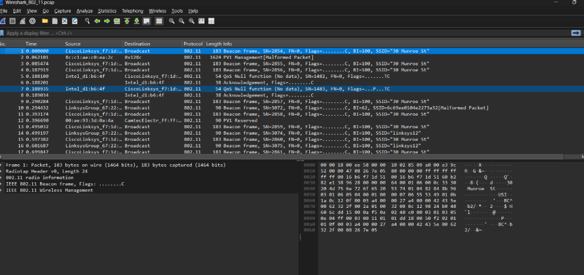
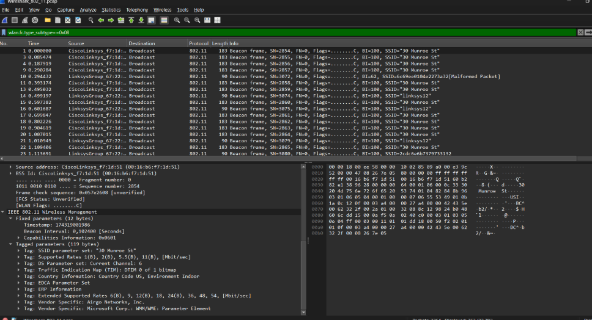

# LAPORAN PRAKTIKUM JARKOM
## MODUL 14 802.11 WiFi  
## Tujuan Praktikum
1. Mahasiswa dapat menginvestigasi cara kerja WiFi menggunakan Wireshark

# Tools yang Digunakan

| Tools | Fungsi |
|--------|--------|
| Wireshark | Melakukan capture dan analisis paket jaringan |
| File Capture WiFi | Data hasil praktikum |
| Sistem Operasi Windows | Lingkungan praktikum |

---

# Langkah-Langkah Praktikum

## 1. Mengunduh File Capture

Unduh file berikut:

```text
wireshark-traces.zip
```

Kemudian ekstrak file tersebut hingga diperoleh file:

```text
Wireshark_802_11.pcap
```

File ini digunakan sebagai sumber data untuk analisis jaringan WiFi pada praktikum.

---

## 2. Membuka File Capture di Wireshark

Langkah-langkah yang dilakukan:

1. Jalankan aplikasi Wireshark.
2. Pilih menu **File → Open**.
3. Buka file berikut:

```text
Wireshark_802_11.pcap
```

4. Klik **Open** untuk menampilkan hasil capture.

Setelah file berhasil dibuka, akan terlihat daftar paket yang ditangkap dari aktivitas jaringan WiFi.

### Hasil Membuka File Capture



> Menunjukkan hasil pembukaan file capture WiFi pada aplikasi Wireshark.

---

## 3. Mengamati Beacon Frame

Beacon Frame merupakan frame manajemen yang dikirim secara berkala oleh Access Point untuk mengumumkan keberadaan jaringan WiFi kepada perangkat di sekitarnya.

Langkah-langkah pengamatan:

1. Cari paket bertipe **Beacon** pada daftar paket.
2. Pilih salah satu paket Beacon.
3. Perhatikan bagian **IEEE 802.11** pada panel detail paket.
4. Amati informasi yang tersedia seperti:
   - SSID
   - Channel
   - Supported Rates
   - Capability Information

### Hasil Analisis Beacon Frame



> Menunjukkan informasi yang terdapat pada Beacon Frame hasil analisis menggunakan Wireshark.

### Analisis Beacon Frame

Dari hasil pengamatan dapat diketahui bahwa Beacon Frame berfungsi sebagai media pengumuman jaringan WiFi. Frame ini memberikan informasi penting mengenai identitas jaringan, kemampuan Access Point, serta parameter yang diperlukan perangkat untuk terhubung ke jaringan tersebut.

---

## 4. Transfer Data pada Jaringan WiFi

Setelah perangkat berhasil terhubung ke Access Point, proses komunikasi data dapat dilakukan menggunakan Data Frame.

Data Frame digunakan untuk membawa berbagai jenis informasi, antara lain:

- Permintaan halaman web
- Pengiriman file
- Komunikasi aplikasi
- Akses layanan internet

Pada file capture yang dianalisis terdapat aktivitas komunikasi antara host dan Access Point yang menunjukkan proses pertukaran data pada jaringan WiFi.

Langkah-langkah analisis:

1. Cari paket data yang berkaitan dengan aktivitas host.
2. Perhatikan alamat sumber dan alamat tujuan paket.
3. Analisis proses komunikasi yang terjadi.
4. Identifikasi alur pengiriman data dari client menuju Access Point.

### Analisis Transfer Data

Hasil pengamatan menunjukkan bahwa Data Frame digunakan sebagai media utama pertukaran informasi pada jaringan WiFi. Data yang dikirim oleh client akan diteruskan melalui Access Point sebelum mencapai tujuan yang diinginkan.

Melalui mekanisme ini, pengguna dapat mengakses berbagai layanan jaringan seperti browsing, email, dan komunikasi data lainnya.

---

## 5. Association pada Jaringan WiFi

Association merupakan proses yang memungkinkan perangkat bergabung ke dalam jaringan WiFi sebelum dapat melakukan pertukaran data.

### Association Request

Association Request dikirim oleh client kepada Access Point sebagai permintaan untuk bergabung ke jaringan.

Frame ini berisi informasi kemampuan perangkat yang akan digunakan selama komunikasi berlangsung.

### Association Response

Association Response merupakan balasan dari Access Point terhadap permintaan yang dikirim oleh client.

Jika permintaan diterima, Access Point akan memberikan izin kepada perangkat untuk bergabung ke jaringan dan melanjutkan komunikasi data.

### Langkah Analisis

1. Cari frame **Association Request**.
2. Amati informasi yang dikirimkan client.
3. Cari frame **Association Response**.
4. Perhatikan balasan dari Access Point.
5. Analisis proses koneksi yang terjadi.

### Analisis Association

Berdasarkan hasil pengamatan, proses Association menjadi tahapan penting sebelum komunikasi data dapat dilakukan. Setelah client berhasil memperoleh respons positif dari Access Point, perangkat dapat mulai bertukar informasi melalui jaringan WiFi.

---

# Hasil dan Analisis

## Analisis Beacon Frame

Beacon Frame berfungsi untuk mengumumkan keberadaan jaringan WiFi kepada perangkat di sekitarnya. Informasi seperti SSID, channel, dan kemampuan jaringan dikirim secara berkala oleh Access Point sehingga perangkat dapat menemukan jaringan yang tersedia.

---

## Analisis Transfer Data

Transfer data pada jaringan WiFi dilakukan menggunakan Data Frame. Frame ini membawa berbagai jenis informasi yang diperlukan selama proses komunikasi berlangsung. Hasil capture menunjukkan bahwa komunikasi antara client dan Access Point berjalan melalui mekanisme pertukaran frame secara berkelanjutan.

---

## Analisis Association

Association merupakan proses pembentukan koneksi antara client dan Access Point. Melalui Association Request dan Association Response, kedua perangkat dapat saling mengenali dan membangun hubungan komunikasi sebelum transfer data dilakukan.

---

# Kesimpulan

1. WiFi menggunakan standar IEEE 802.11 untuk menyediakan komunikasi jaringan secara nirkabel.
2. Beacon Frame berfungsi mengumumkan keberadaan Access Point serta memberikan informasi penting mengenai jaringan WiFi.
3. Proses Association memungkinkan client bergabung ke jaringan sebelum melakukan pertukaran data.
4. Transfer data pada jaringan WiFi dilakukan menggunakan Data Frame yang membawa berbagai informasi komunikasi.
5. Wireshark membantu proses analisis jaringan dengan menampilkan detail frame IEEE 802.11 sehingga mekanisme komunikasi WiFi dapat dipahami dengan lebih baik.

---
