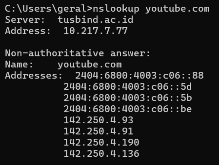
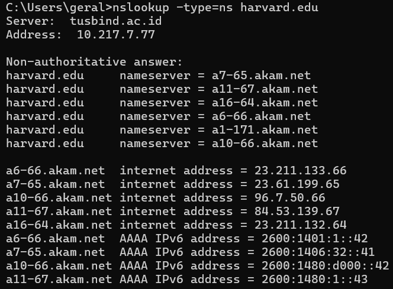
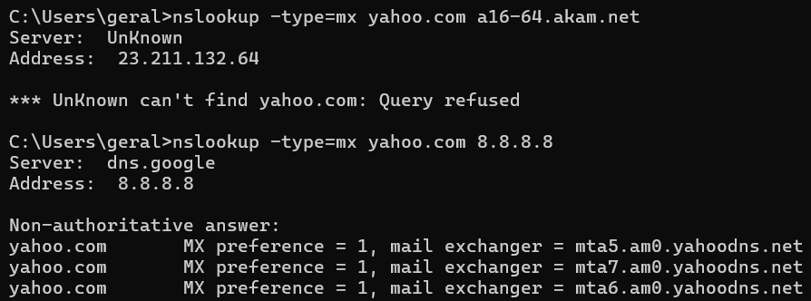

# LAPORAN PRAKTIKUM JARKOM
## MODUL 4 DNS
## Tujuan Praktikum
Mahasiswa dapat menginvestigasi cara kerja DNS menggunakan Wireshark

## Langkah Percobaan
4.2 Nslookup
4.4 Tracing DNS dengan Wireshark

## 4.2 Nslookup
Soal 1 Jalankan nslookup untuk mendapatkan alamat IP dari server web di Asia. Berapa alamat IP 
server tersebut? 

Soal 2 Jalankan nslookup agar dapat mengetahui server DNS otoritatif untuk universitas di Eropa.

Soal 3 Jalankan nslookup untuk mencari tahu informasi mengenai server email dari Yahoo! Mail 
melalui salah satu server yang didapatkan di pertanyaan nomor 2. Apa alamat IP-nya? 

